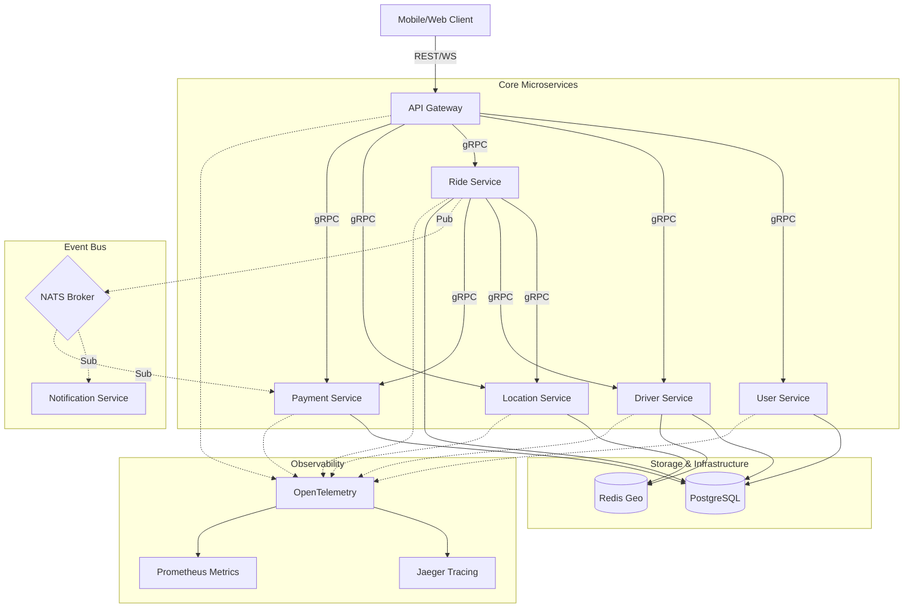

# Go Uber Clone - Microservices Architecture

A high-performance, distributed ride-sharing platform built with Go, gRPC, and a modular microservices architecture. This project demonstrates production-grade patterns for real-time tracking, event-driven communication, and scalable system design.

---

## 🏗️ System Architecture

The platform is built on a modular microservices architecture, where each service is a self-contained unit of deployment and scaling. This design ensures high availability, fault isolation, and independent evolution of system components.

### Architectural Diagram



### Core Microservices

#### 🛡️ API Gateway (`services/api-gateway`)
- **Role**: Single entry point and security layer for the entire cluster.
- **Responsibilities**: 
  - **Auth**: Validates JWTs and injects user/driver context into gRPC metadata.
  - **Routing**: Maps RESTful resources to internal gRPC service methods.
  - **Real-time**: Manages stateful WebSocket connections for live map updates and notifications.
  - **Resilience**: Implements request timeouts and error aggregation.
- **Tech Stack**: Gin Gonic (HTTP), Gorilla (WebSockets), gRPC-Go.

#### 👤 User Service (`services/user-service`)
- **Role**: Source of truth for identity and profile data.
- **Responsibilities**: 
  - Manages the lifecycle of Riders and Drivers.
  - Handles secure authentication, password hashing (bcrypt), and profile management.
  - Provides internal gRPC lookups for user metadata.
- **Data Model**: Relational schema in PostgreSQL for persistent profile data.

#### 🚗 Driver Service (`services/driver-service`)
- **Role**: Fleet management and driver availability engine.
- **Responsibilities**: 
  - Tracks driver-specific attributes (vehicle type, license, ratings).
  - Manages real-time availability states (Online, Offline, Busy).
  - Interfaces with Redis to cache transient status data for high-speed lookups.
- **Data Model**: PostgreSQL for master data; Redis for volatile status flags.

#### 📍 Location Service (`services/location-service`)
- **Role**: High-performance geospatial processing engine.
- **Responsibilities**: 
  - **Ingestion**: Processes thousands of GPS pings per second from active drivers.
  - **Geo-Queries**: Executes `GEORADIUS` queries to find the closest drivers for a ride request.
  - **Routing**: Provides distance and duration estimates between coordinates.
- **Data Model**: Optimized Redis Geospatial indexes (`GEOADD`, `GEOPOS`).

#### 🏁 Ride Service (`services/ride-service`)
- **Role**: The "Brain" of the system, orchestrating the ride lifecycle.
- **Responsibilities**: 
  - **State Machine**: Manages transitions from `REQUESTED` → `MATCHED` → `IN_PROGRESS` → `COMPLETED`.
  - **Matching Logic**: Coordinates between Location and Driver services to pair riders with the best available drivers.
  - **Event Sourcing**: Emits critical lifecycle events to NATS for downstream consumption.
- **Data Model**: PostgreSQL for ride records, including audit trails of state changes.

#### 💳 Payment Service (`services/payment-service`)
- **Role**: Financial settlement and transaction management.
- **Responsibilities**: 
  - Calculates final fares based on distance, time, and dynamic surge multipliers.
  - Processes secure transactions and maintains a history of user/driver balances.
  - Consumes `ride.completed` events to trigger automated billing.
- **Data Model**: PostgreSQL with strict transactional integrity for ledger entries.

#### 🔔 Notification Service (`services/notification-service`)
- **Role**: Decoupled communication engine.
- **Responsibilities**: 
  - Listens for NATS events (e.g., `ride.requested`, `payment.success`).
  - Dispatches multi-channel alerts (WebSocket push, SMS, Email).
  - Ensures riders and drivers are kept in sync without blocking core business logic.

---

## 📡 Communication & Observability

The platform leverages modern communication protocols and a robust observability stack to ensure low latency, high availability, and deep system visibility.

### 🔌 Communication Protocols

#### **gRPC (Synchronous)**
- **Usage**: Primary protocol for internal service-to-service communication.
- **Benefits**: Strong typing with Protocol Buffers, efficient binary serialization, and built-in support for bi-directional streaming.
- **Implementation**: Every service implements a gRPC server and uses generated clients to call downstream services. Load balancing is handled at the client level or via service mesh.

#### **NATS (Asynchronous)**
- **Usage**: Event-driven architecture for decoupled service interactions.
- **Patterns**:
    - **Pub/Sub**: Broadcasting events like `ride.requested` to multiple subscribers (Notification, Driver services).
    - **JetStream**: Used for persistent message streams, ensuring "at-least-once" delivery for critical events like payment processing.
- **Benefits**: Extremely high throughput, low latency, and simplified service discovery.

#### **WebSockets (Real-time)**
- **Usage**: Bi-directional communication between the API Gateway and client applications.
- **Use Cases**:
    - **Driver Tracking**: Streaming real-time GPS coordinates from the driver app to the rider app.
    - **Live Notifications**: Immediate updates on ride status changes (Accepted, Arrived, Completed).
- **Implementation**: Managed by the API Gateway using the Gorilla WebSocket library.

---

### 📊 Observability Stack

The system is fully instrumented using **OpenTelemetry (OTel)** standards, providing a unified approach to telemetry data.

#### **Distributed Tracing (Jaeger)**
- **Instrumentation**: Every gRPC call and HTTP request is injected with a trace context.
- **Visualization**: Use the Jaeger UI to visualize the entire lifecycle of a request as it traverses multiple microservices.
- **Value**: Quickly identify bottlenecks, failed spans, and latency issues in complex distributed flows.

#### **Metrics & Monitoring (Prometheus & Grafana)**
- **Collection**: Services expose a `/metrics` endpoint in Prometheus format, instrumented with custom counters and histograms.
- **Key Metrics**:
    - **RED Pattern**: Request rate, Error rate, and Duration (latency) for every gRPC method.
    - **Business Metrics**: Active rides, available drivers, and average matching time.
- **Visualization**: Pre-configured Grafana dashboards provide a real-time view of system health and performance.

#### **Structured Logging**
- **Format**: All logs are emitted in structured JSON format.
- **Context**: Logs include `trace_id` and `span_id`, allowing you to correlate logs with specific traces in Jaeger.
- **Value**: Simplifies log aggregation and searching in tools like ELK or Loki.

---

## 🚀 Detailed User Flow: Booking a Ride

The following sequence illustrates the deep interaction between services during a typical ride lifecycle, from initial estimation to final payment.

### 1. Pre-Ride: Estimation & Discovery
*   **Step**: Rider opens the app and enters a destination.
*   **API**: `POST /api/v1/rides/estimate`
*   **Internal Flow**:
    1.  **API Gateway** forwards request to **Ride Service** (`EstimateRide`).
    2.  **Ride Service** calls **Location Service** (`GetRoute`) to calculate distance and duration using OSRM/Google Maps logic.
    3.  **Ride Service** calls **Payment Service** to apply current pricing rules and surge multipliers.
    4.  **Result**: Rider sees multiple vehicle options (UberX, XL, Black) with price ranges and ETAs.

### 2. The Request: Booking & Matching
*   **Step**: Rider selects a vehicle and clicks "Request".
*   **API**: `POST /api/v1/rides/request`
*   **Internal Flow**:
    1.  **Ride Service** (`RequestRide`) creates a new ride entry in PostgreSQL with status `REQUESTED`.
    2.  **Ride Service** queries **Location Service** (`GetNearbyDrivers`) to find the top 5 available drivers within a 5km radius.
    3.  **Event**: **Ride Service** publishes a `ride.requested` message to **NATS**.
    4.  **Notification**: **Notification Service** consumes the event and sends a WebSocket push to the selected drivers.

### 3. Acceptance: Driver Handshake
*   **Step**: A driver sees the request and clicks "Accept".
*   **API**: `POST /api/v1/rides/:id/accept`
*   **Internal Flow**:
    1.  **Ride Service** (`AcceptRide`) uses distributed locking (via Redis) to ensure only one driver can accept the ride.
    2.  Status updates to `ACCEPTED`. Driver's status in **Driver Service** changes to `BUSY`.
    3.  **Event**: A `ride.accepted` message is published.
    4.  **Sync**: **API Gateway** pushes the driver's details (name, vehicle, rating) to the rider's app via WebSocket.

### 4. The Pickup: Real-Time Tracking
*   **Step**: Driver navigates to the rider's location.
*   **API**: `POST /api/v1/drivers/location` (Called every 3-5 seconds by Driver app).
*   **Internal Flow**:
    1.  **Location Service** (`UpdateLocation`) updates the driver's coordinates in a Redis Geospatial index.
    2.  **API Gateway** maintains a persistent WebSocket connection (`/ws/ride/:id`) with the rider.
    3.  **Streaming**: The Gateway streams the driver's `latitude`, `longitude`, and `heading` directly to the rider's map for smooth movement visualization.

### 5. In-Ride: Journey Management
*   **Step**: Driver arrives and starts the ride.
*   **API**: `POST /api/v1/rides/:id/start` followed by `POST /api/v1/rides/:id/complete`.
*   **Internal Flow**:
    1.  **Start**: Status moves to `IN_PROGRESS`. **Ride Service** records the `started_at` timestamp.
    2.  **Complete**: Status moves to `COMPLETED`. **Ride Service** records the `completed_at` timestamp and final GPS coordinates.
    3.  **Event**: A `ride.completed` message is published to **NATS**.

### 6. Post-Ride: Settlement & Feedback
*   **Step**: Fare is charged and user provides a rating.
*   **Internal Flow**:
    1.  **Payment**: **Payment Service** consumes `ride.completed`, calculates the final fare based on actual distance/time, and processes the transaction.
    2.  **Rating**: Rider calls `POST /api/v1/rides/:id/rate`. **Ride Service** updates the ride record and triggers an async update to the driver's aggregate rating in **Driver Service**.

---

## 🛠️ Getting Started

Follow these instructions to get a local development environment up and running.

### 📋 Prerequisites
Ensure you have the following installed:
- **Go 1.21+**: [Download and Install](https://go.dev/doc/install)
- **Docker & Docker Compose**: [Get Docker](https://docs.docker.com/get-docker/)
- **Protoc Compiler**: Required for generating gRPC code from `.proto` files.
- **Make**: For running automation scripts.

### ⚙️ Installation & Setup

1.  **Clone the Repository**:
    ```bash
    git clone https://github.com/your-username/go-uber-clone.git
    cd go-uber-clone
    ```

2.  **Environment Configuration**:
    The services are pre-configured with sensible defaults for local development in `docker-compose.yml`. Key environment variables include:
    - `JWT_SECRET`: Used for signing and validating authentication tokens.
    - `DB_URL`: PostgreSQL connection string.
    - `REDIS_ADDR`: Address for the Redis cache and geospatial engine.
    - `NATS_URL`: Connection string for the NATS message broker.

3.  **Generate gRPC Code**:
    If you make changes to any `.proto` files in the `proto/` directory, regenerate the Go code:
    ```bash
    make proto
    ```

4.  **Spin Up the Infrastructure & Services**:
    This command builds the Docker images and starts all microservices along with the required infrastructure (Postgres, Redis, NATS, Jaeger, Prometheus, Grafana).
    ```bash
    make docker-up
    ```

5.  **Run Database Migrations**:
    Apply the SQL schemas to the PostgreSQL instance:
    ```bash
    make migrate
    ```

### 🔍 Verifying the Installation

- **API Gateway**: Accessible at `http://localhost:8080`.
- **Swagger Documentation**: View and test the REST API at `http://localhost:8080/swagger/index.html`.
- **Health Check**: Run `docker ps` to ensure all 10+ containers are in a `healthy` or `running` state.

### 📊 Monitoring & Observability

Once the stack is running, you can access the following tools to monitor the system:

| Tool | URL | Description |
| :--- | :--- | :--- |
| **Jaeger UI** | `http://localhost:16686` | Distributed tracing for end-to-end request analysis. |
| **Prometheus** | `http://localhost:9090` | Time-series database for system and service metrics. |
| **Grafana** | `http://localhost:3000` | Dashboards for visualizing metrics (Login: `admin/admin`). |
| **NATS Management** | `http://localhost:8222` | Monitoring for the NATS message broker. |

### 🧪 Running Tests
- **Unit Tests**: `go test ./...`
- **API Tests**: A comprehensive test script is provided in `api_tests.sh`. Run it to simulate a full ride lifecycle:
  ```bash
  chmod +x api_tests.sh
  ./api_tests.sh
  ```

### 🛠️ Manual API Testing Guide

You can manually test the API endpoints using `curl` or any API client (Postman/Insomnia). Follow these steps to simulate a ride lifecycle.

### 🛠️ Manual API Testing Guide

You can manually test the API endpoints using `curl` or any API client (Postman/Insomnia). Follow these steps to simulate a complete ride lifecycle, from user registration to ride finalization.

#### 1. Setup Environment Variables
To make the commands easier to run, set the base URL:
```bash
export BASE_URL="http://localhost:8080/api/v1"
```

#### 2. User Registration & Authentication
Register both a rider and a driver, then obtain their JWT tokens.

```bash
# Register a Rider
curl -X POST $BASE_URL/auth/register \
     -H "Content-Type: application/json" \
     -d '{"email":"rider@example.com", "password":"password123", "name":"John Rider", "role":"RIDER"}'

# Login as Rider and save token
RIDER_TOKEN=$(curl -s -X POST $BASE_URL/auth/login \
     -H "Content-Type: application/json" \
     -d '{"email":"rider@example.com", "password":"password123"}' | jq -r .token)

# Register a Driver
curl -X POST $BASE_URL/auth/register \
     -H "Content-Type: application/json" \
     -d '{"email":"driver@example.com", "password":"password123", "name":"Jane Driver", "role":"DRIVER"}'

# Login as Driver and save token
DRIVER_TOKEN=$(curl -s -X POST $BASE_URL/auth/login \
     -H "Content-Type: application/json" \
     -d '{"email":"driver@example.com", "password":"password123"}' | jq -r .token)
```

#### 3. Driver Onboarding & Availability
A driver must register their vehicle and set their status to `AVAILABLE` to receive ride requests.

```bash
# Register Driver Vehicle Details
curl -X POST $BASE_URL/drivers/register \
     -H "Authorization: Bearer $DRIVER_TOKEN" \
     -H "Content-Type: application/json" \
     -d '{
       "vehicle_make": "Tesla",
       "vehicle_model": "Model 3",
       "vehicle_color": "White",
       "license_plate": "UBER-123",
       "vehicle_type": "UBERX"
     }'

# Update Driver Status to AVAILABLE
curl -X PUT $BASE_URL/drivers/status \
     -H "Authorization: Bearer $DRIVER_TOKEN" \
     -H "Content-Type: application/json" \
     -d '{"status":"AVAILABLE"}'

# Update Driver Location (Required for matching)
curl -X POST $BASE_URL/drivers/location \
     -H "Authorization: Bearer $DRIVER_TOKEN" \
     -H "Content-Type: application/json" \
     -d '{"latitude": 37.7749, "longitude": -122.4194}'
```

#### 4. Ride Lifecycle: From Request to Completion
Simulate the core ride-sharing flow.

```bash
# Step A: Get Ride Estimate (Optional but recommended)
curl -X POST $BASE_URL/rides/estimate \
     -H "Authorization: Bearer $RIDER_TOKEN" \
     -H "Content-Type: application/json" \
     -d '{
       "pickup_location": {"latitude": 37.7749, "longitude": -122.4194},
       "dropoff_location": {"latitude": 37.7833, "longitude": -122.4167}
     }'

# Step B: Request a Ride
RIDE_ID=$(curl -s -X POST $BASE_URL/rides/request \
     -H "Authorization: Bearer $RIDER_TOKEN" \
     -H "Content-Type: application/json" \
     -d '{
       "pickup_location": {"latitude": 37.7749, "longitude": -122.4194, "address": "Market St"},
       "dropoff_location": {"latitude": 37.7833, "longitude": -122.4167, "address": "Union Square"},
       "vehicle_type": "UBERX",
       "payment_method": "CARD"
     }' | jq -r .ride_id)

# Step C: Accept the Ride (Driver)
curl -X POST $BASE_URL/rides/$RIDE_ID/accept \
     -H "Authorization: Bearer $DRIVER_TOKEN"

# Step D: Start the Ride (Driver has picked up the Rider)
curl -X POST $BASE_URL/rides/$RIDE_ID/start \
     -H "Authorization: Bearer $DRIVER_TOKEN"

# Step E: Complete the Ride (Finalize and trigger payment)
curl -X POST $BASE_URL/rides/$RIDE_ID/complete \
     -H "Authorization: Bearer $DRIVER_TOKEN" \
     -H "Content-Type: application/json" \
     -d '{"final_location": {"latitude": 37.7833, "longitude": -122.4167}}'
```

#### 5. Post-Ride: Rating & History
```bash
# Rate the Driver (Rider)
curl -X POST $BASE_URL/rides/$RIDE_ID/rate \
     -H "Authorization: Bearer $RIDER_TOKEN" \
     -H "Content-Type: application/json" \
     -d '{"rating": 5.0, "comment": "Great ride!"}'

# View Ride History
curl -X GET $BASE_URL/rides/history \
     -H "Authorization: Bearer $RIDER_TOKEN"
```

#### 6. Real-time Monitoring (WebSockets)
To observe real-time state changes and location updates, connect to the WebSocket endpoints using `wscat`:

```bash
# Monitor Ride Updates (Rider perspective)
wscat -c ws://localhost:8080/ws/ride/$RIDE_ID -H "Authorization: Bearer $RIDER_TOKEN"

# Monitor Live Notifications
wscat -c ws://localhost:8080/ws/notifications -H "Authorization: Bearer $RIDER_TOKEN"
```

### ❓ Troubleshooting
- **Port Conflicts**: Ensure ports `8080`, `5432`, `6379`, `4222`, `16686`, and `3000` are not being used by other applications.
- **Docker Resources**: The full stack requires at least 4GB of RAM allocated to Docker.
- **Database Connection**: If services fail to start, ensure the `uber-postgres` container is healthy before restarting the microservices.

---

## 🔮 Roadmap & Future Updates

We are evolving this platform into a production-grade reference architecture. Below are the planned technical milestones.

### 🏗️ Infrastructure & Scalability
- [ ] **Kubernetes Native Deployment**:
    - **Manifests**: Production-ready `Deployment`, `Service`, `ConfigMap`, and `Secret` objects.
    - **Helm Charts**: Parameterized charts for managing multi-tenant and multi-environment (Dev/Staging/Prod) deployments.
    - **Horizontal Pod Autoscaling (HPA)**: Scaling services based on custom metrics (e.g., NATS queue depth, gRPC request latency).
- [ ] **Service Mesh (Istio/Linkerd)**:
    - **mTLS**: Zero-trust networking with encrypted service-to-service communication.
    - **Traffic Management**: Implementation of Canary releases and Blue/Green deployments using VirtualServices.
    - **Resilience**: Fine-grained circuit breaking and outlier detection to prevent cascading failures.
- [ ] **Multi-region Global Deployment**:
    - **Geo-routing**: Using Anycast IP or Latency-based DNS to route users to the nearest cluster.
    - **Data Replication**: Cross-region PostgreSQL replication and global Redis clusters for low-latency location lookups.

### 💡 Advanced Business Logic
- [ ] **Ride Pooling & Route Optimization**:
    - **Algorithm**: Implementing a graph-based matching engine (Dijkstra/A*) to find optimal pickup sequences for multiple riders.
    - **Constraint Solver**: Balancing detour time vs. cost savings for pooled participants.
- [ ] **Dynamic Pricing ML Engine**:
    - **Model**: A Python-based sidecar or microservice running a Random Forest or XGBoost model.
    - **Features**: Real-time demand (active riders), supply (available drivers), weather data, and historical trends.
- [ ] **Financial Ledger & Payout System**:
    - **Double-Entry Ledger**: A robust, immutable accounting system for tracking every cent.
    - **Scheduled Payouts**: Automated weekly driver settlements via Stripe Connect or similar providers.
- [ ] **Admin Fleet Management**:
    - **Dashboard**: A React/Next.js interface for real-time system monitoring, manual ride interventions, and driver document verification.

### 🛡️ Security & Reliability
- [ ] **Advanced Rate Limiting**:
    - **Gateway Level**: Distributed rate limiting using a Redis-backed Token Bucket algorithm to protect against API abuse.
    - **Tiered Limits**: Different quotas for anonymous vs. authenticated vs. premium users.
- [ ] **Event Sourcing & CQRS**:
    - **Audit Trail**: Transitioning core ride and payment logic to an event-sourced model for 100% auditability.
    - **Projections**: Using NATS JetStream to build specialized read-models for the history and analytics services.
- [ ] **Automated E2E Testing**:
    - **Testcontainers**: Using Go Testcontainers to spin up real PostgreSQL, Redis, and NATS instances for every CI run.
    - **Chaos Engineering**: Integrating LitmusChaos to test system resilience under network partitions and service failures.
- [ ] **gRPC-Web & Envoy**:
    - **Browser Support**: Configuring Envoy as a front-proxy to allow direct gRPC calls from web frontends, bypassing the need for a REST shim.

---

## 📜 License
This project is licensed under the MIT License - see the [LICENSE](LICENSE) file for details.
